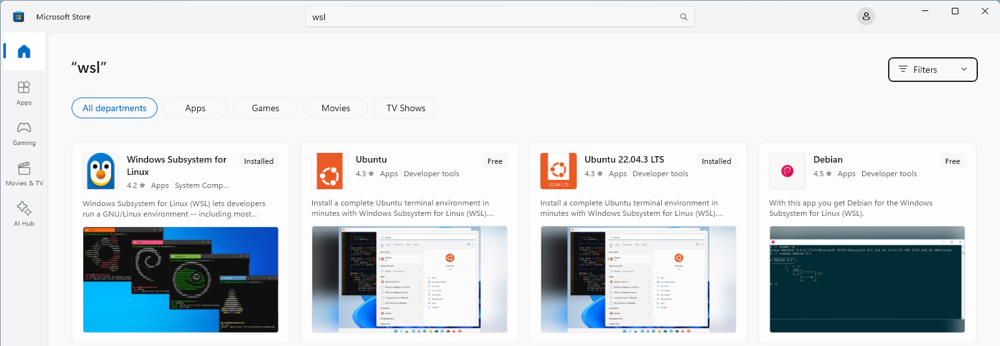
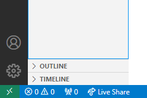
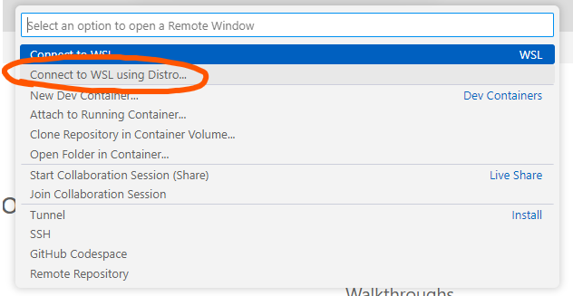

# Установка программного обеспечения для курсов "Алгоритмы и Алгоритмические Языки" и "Архитектура ЭВМ и Язык Ассемблера"

Практика показывает, что разработка больших программных проектов на C, C++ и языках ассемблера на профессиональном уровне лучше организуется в OC Linux или Mac OS.

Разработка и отладка ПО на языке ассемблера накладывает дополнительное орграничение: необходимо иметь либо доступ к физическому процессору нужной архитектуры (в курсе ASM целевая архитектура - это i386), либо эмулятор (виртуальную машину).

При этом большинство студентов как правило начинает с ОС Windows или Mac OS и обладают процессором архитектуры x86_64 или ARMv8.

Данный материал откладывает на потом решение проблемы заполучения процессора нужной архитектуры и описывает возможные подходы к настройке окружения для разработки ПО на C/C++.

## Настройка окружения для обладателей Mac OS

ToDo

## Настройка окружения для обладателей OC Windows

Возможно вести разработку в трёх разных средах:
1. Установка WSL (Window Subsystem for Linux).
2. Непосредственная установка Linux как основной системы или в dual-boot с уже имеющейся.
3. Запуск ОС Linux в виртуальной машине (вариант для курса по ASM).

В любом из этих вариантов также придётся установить IDE.

Рекомендуемая IDE - Visual Studio Code ([скачивание](https://code.visualstudio.com/download), [настройка](https://code.visualstudio.com/docs/languages/cpp)).

IDE для контрольных работ (по умолчанию неудобная подсветка синтаксиса) - [Code::Blocks](https://www.codeblocks.org/downloads/).

### Установка WSL

1. Установка WSL в Windows.

WSL можно скачать из магазина приложений Microsoft Store.
Достаточно установить приложения "Windows Subsystem for Linux" и "Ubuntu":



После установки обоих приложений следует открыть приложение "Ubuntu".
При этом откроется терминал, в котором следует пройти инициализацию и создать пользователя.

Файловая система Linux будет доступна из Explorer-а в Windows:


Для дальнейшей работы необходимо установить пакеты:
```
sudo apt-get install build-essential cmake
```

2. Настройка CLion.

Для того, чтобы подружить CLion и WSL, необходимо:
- Открыть окно `File -> Settings -> Build, Execution, Deployment -> Toolchains`.
- Нажать `+` и добавить WSL;
- Установить WSL как toolchain по умолчанию:


3. Настройка VS Code.

Для того, чтобы подружить CLion и WSL, необходимо:
- Установить расширение WSL;
- После запуска VS Code нажать на зелёную кнопку в левом нижнем углу:



- Выбрать подключение к WSL:



### Запуск ОС Linux на железе

Полезные ссылки:
- [Последовательность установки Ubuntu Linux](https://ubuntu.com/tutorials/install-ubuntu-desktop#1-overview).
- [Последовательность установки Linux Mint](https://linuxmint-installation-guide.readthedocs.io/en/latest/).

### Запуск ОС Linux в виртуальной машине

Этот вариант достаточно сложен. Кроме того, гостевая виртуальная машина обладает более низким быстродействием по сравнению с хостовой машиной. Поэтому он рекомендуется только для курса по ASM и только для обладателей процессора архитектуры, отличной от x86_64.

1. Разрешение виртуализации из загрузчика и хостовой ОС.

Для использования виртуализации в хостовой ОС её поддержку сначала надо включить.
Этот процесс зависит от загрузчика ОС (BIOS), от установленной ОС и модели компьютера.

2. Установка ПО для виртуализации.

Рекомендуемое ПО - [VirtualBox](https://www.virtualbox.org/wiki/Downloads).

3. Выбор образа госевой ОС.

Рекомендуемый образ - [VM-образ Ubuntu Linux c официального сайта](https://xubuntu.org/download/).

4. Создание новой виртуальной машины.

На этом этапе необходимо указать к образу и выбрать его тип (ОС Linux, Ubuntu 64-bit).
Рекомендуемый объём RAM виртуальной машины - половина полного объёма RAM (2+ Гб).
Минимальный рекомендуемый размер виртуального жёсткого диска - 25+ Гб.

5. Конфигурация виртуальной машины.

В настройках виртуальной машины требуется:
- В пункте `General->Advanced`:
	- Включить общий буфер обмена и Drag'n'drop (для удобства);
- В пункте `System->Motherboard`:
	- Установить рекомендуемое кол-во ядер, передаваемых виртуальной машине - половина от имеющихся;
- В пункте `System->Processor`:
	- Установить максимальная загрузка CPU в 100%;
	- Убедиться, что галочка в пункте `Enable Nested VT-X/AMD-V` выставлено (иначе - см. этап (1)).
- В пунтке `Display`:
	- Установить размер видеопамяти в максимальный возможный;
	- Установить галочку около `3D Acceleration`.

Также рекомендуется ознакомиться с shortcut-ом "вынести курсор из виртуальной машины", чтобы не пасть заложником виртуального мира.

6. Первый запуск виртуальной машины

При запуске необходимо указать путь к загруженному файлу загрузочного образа Ubuntu.

Первый запуск VM эквивалентен первому запуску ОС на железе.
Во время первого запуска будет необходимо установить язык, часовой пояс, указать логин+пароль для ОС.
Рекомендованная для использования версия ОС - "Minimal Version" без предзагрузки пакетов.

Важно дождаться переноса всех необходимых файлов из загрузочного образа, не нажимая кнопки SKIP.

7. Инициализация пакетного менеджера на виртуальной машины.

При первом запуске после загрузки системы необходимо открыть терминал (`Ctrl+Alt+T`) и выполнить команды:
```shell
sudo apt update
sudo apt upgrade
```
Эти команды произведут обновление всех пакетов на машине.
После завершения работы последней команды необходимо выключить виртуальную машину.

После перезапуска рекомендуется зайти в пункт меню Ubuntu под названием "Display" и установить комфортное для работы разрешение экрана.

8. Виртуальная машина готова к работе!

## Памятка по основным командам консоли Linux

Документация на любую команду консоли доступна по команде `man`.
Например, документация на команду `cat` высветится по команде `man cat`.

Полезные ссылки:
- [Туториал по базовой функциональности консоли Linux](https://ubuntu.com/tutorials/command-line-for-beginners#1-overview).
